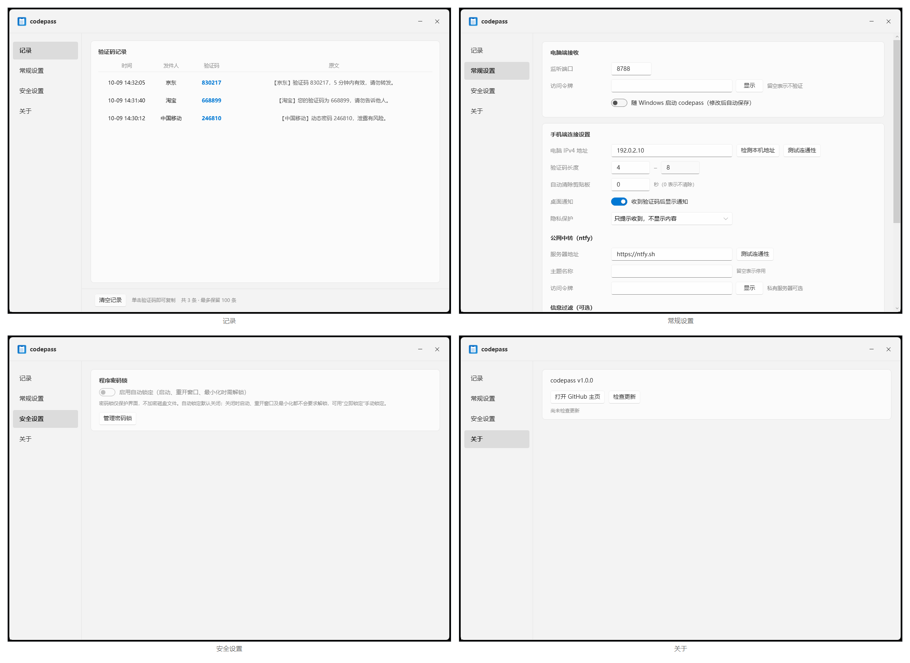

<div align="center">


# codepass

**Sync Android SMS verification codes to the Windows clipboard.**

Android phone forwards the SMS → Windows detects the code → writes it to the clipboard.

[](https://github.com/Murciee/codepass/releases/latest)
[](https://github.com/Murciee/codepass/releases)
[](#quick-start-lan-mode)
[](#recommended-setup)
[](LICENSE)
[](https://github.com/Murciee/codepass/stargazers)

[Downloads](#downloads) · [Quick Start](#quick-start-lan-mode) · [Recommended Setup](#recommended-setup) · [Public Network](#public-network-ntfy) · [Building](#building) · [FAQ](#faq) · [Documentation](#documentation-index)

[简体中文](README.md) · **English**

</div>

> [!WARNING]
> No support is provided, and compatibility or ongoing maintenance is not promised. The Windows package is not code-signed. The LSPosed release APK uses a fixed release certificate; debug and unsigned APKs are not release assets. Read the [Disclaimer](DISCLAIMER.md) and [Privacy Notice](PRIVACY.md) before use.

```text
New Android SMS → LAN / EasyTier / ntfy → Windows detects the code → clipboard
```

<div align="center">



</div>

## Features

| Capability | Description |
| --- | --- |
| 📋 Auto copy | Writes the detected code to the clipboard, with optional desktop notification and auto-clear |
| 🌐 Two channels | LAN HTTP (default `8787`); optional ntfy relay over the internet; or an EasyTier network |
| 🖥️ Tray resident | Native single-file `codepass.exe`, depending only on the built-in .NET Framework 4.x |
| 🔐 Privacy & security | Access token, notification masking, program passcode lock, config import/export |
| 🕘 Recent history | Keeps the last 100 records; click a code to copy it |
| 📱 Multiple phone options | No-root Webhook, root script, Magisk, LSPosed — pick one |
| 🎨 Interface | Native Fluent rounded UI on Windows; lightweight WebUI for Magisk |

## Downloads

The current source version is **v1.0.3**. Download installers from [GitHub Releases](https://github.com/Murciee/codepass/releases); only assets actually published there are available. A source commit is not a published release.

| Asset | Purpose |
| --- | --- |
| `codepass-windows.zip` | Native Windows client; extract and run `codepass.exe`, with no extra runtime installation |
| `codepass-sms-magisk.zip` | Module for phones with Magisk already installed |
| `codepass-lsposed-release.apk` | Release-signed native module for phones with LSPosed already installed |
| `SHA256SUMS.txt` | SHA-256 checksums of the three assets; checksums do not replace signature or source verification |

Choose one phone option, not both modules. The `release/` directory is excluded from source commits; installers are uploaded separately as release assets.

**Upgrading:** quit Windows from the tray, replace only `codepass.exe`, and keep your configuration and history. Switching from a debug APK usually requires uninstalling it first and loses app configuration. The new LSPosed module no longer reads the old `lsposed.conf`; enter settings in the app.

### Validation limits

Native builds, 23 synthetic HTTP/security tests, WPF view parsing, APK signature/alignment verification, and an independent read-only code review passed. Device installation, actual SMS hooks, lock-screen/reboot behavior, and Magisk installation still require device testing; compatibility with every ROM is not promised.

## Recommended Setup

Most users should use “LAN + no-root Webhook”: simple, low latency, no root required.

| Phone environment | Recommended option | Notes |
| --- | --- | --- |
| 🌱 Not rooted | [No-root guide](phone/no-root.md) | Webhook apps such as SmsForwarder |
| 🧱 Magisk installed | [Magisk guide](phone/magisk/README.md) | Runs at boot; WebUI available |
| ⌨️ Rooted | [Root client](phone/README.md) | Easy to configure and debug |
| 🔌 LSPosed installed | [LSPosed guide](phone/lsposed/README.md) | Experimental; ROM-dependent |

Enable only one option to avoid duplicate messages.

## Quick Start: LAN Mode

1. **Windows**: run `codepass.exe` (single file; config lives next to the EXE). Set a random access token, select the PC IPv4 using “Detect local address”, then quit from the tray and restart. Allow “Private networks” if the firewall asks.
2. **Phone**: Webhook target `http://PC-IPv4:8787/sms`, method `POST`, body = the SMS body variable; pass the token in the `X-Token` header or a `?token=` parameter.
3. **Verify**: click “Test connectivity”, then send a test SMS — the detected code is written to the clipboard and shown on the history page.

```text
http://PC-IPv4:8787/sms
X-Token: your-token
```

> Closing the window hides it to the tray. Restart after changing the bound address, port, ntfy, or whether a token is set. Replacing an existing token applies immediately; clearing it immediately rejects LAN requests.

## Windows Settings

| Setting | Description |
| --- | --- |
| Listen port / access token | TCP port (default `8787`) and the shared LAN token |
| Start with Windows | Launches after user login, no admin rights required |
| Code length | Auto-detected digit length, default 4–8, adjustable to 1–32 |
| Auto-clear clipboard | Seconds before clearing; `0` disables |
| Desktop notification / privacy | Whether to notify, and three levels of notification masking |
| Message filter | Line-by-line keywords or .NET regex; a match ignores that SMS |
| Program passcode lock | Protects settings and history, with optional auto-lock |
| About & update check | Version and GitHub page; opens the download page for manual updates |
| ntfy settings | Server, topic, and token for public-network relay |

Notes: fields save on blur or Enter. Code length, notification content, and replacing an existing token apply immediately. Restart after changing the bound address, port, ntfy, or whether a token is set. Data files live next to the EXE.

## Public Network: ntfy

When the phone and PC are not on the same network, enter the same HTTPS server, topic, and token on both devices, then restart Windows. Prefer a private authenticated service; a public topic name is not reliable access control. See [`phone/ntfy.md`](phone/ntfy.md).

## Network Interface

```http
POST http://PC-IPv4:8787/sms      # body: code / full SMS / JSON {"code":"654321"}
GET  http://PC-IPv4:8787/health   # health check, returns {"ok":true}
```

Pass the token via the `X-Token` header or `?token=`. When a token is set, both endpoints validate it and return `403` on mismatch. The body limit is about 1 MiB. Local HTTP is unencrypted — do not expose it to the internet.

## FAQ

- **Phone can't reach the PC**: confirm the same Wi-Fi / EasyTier, the PC's current IPv4 address, matching port and token, and an allowed firewall (for EasyTier use its adapter address).
- **SMS arrives but no code is detected**: confirm the SMS reached the PC and check the “Code length” range.
- **No notification and no clipboard content**: usually the clipboard is held by another program. Common culprits: game accelerators, clipboard tools (Ditto, PowerToys, Snipaste), remote control (ToDesk, Sunlogin, NetEase UU, `rdpclip`), some input methods and office suites; a reboot usually clears it.
- **Port / ntfy changes don't apply**: they apply only at startup — quit from the tray and restart.
- **Forwarding stops after screen lock**: disable battery optimization, allow autostart and background running, and lock the task in recents.

## Security and Risk

- LAN reception requires a random access token. An empty token binds only to loopback; never expose the port to the internet;
- Never commit the ntfy topic or token to a public repository; the server must use HTTPS;
- `app.log`, `history.txt`, and phone config may contain codes or tokens — protect them;
- The passcode lock protects the UI only and does not encrypt local data; masking is not full privacy protection.

**This is a personal open-source tool provided “as is”, with no support or maintenance promised.** Before use, read the [Disclaimer](DISCLAIMER.md), [Privacy Notice](PRIVACY.md), [Third-Party Notices](THIRD_PARTY_NOTICES.md), [Security](SECURITY.md), and [Support](SUPPORT.md) policies. Released under the [MIT License](LICENSE).

## Building

| Target | Command | Artifact |
| --- | --- | --- |
| Windows native single file | `windows\build.ps1` | `windows/dist/codepass.exe` |
| LSPosed native module (development test) | `phone\lsposed\build.ps1` | `phone/lsposed/app/build/outputs/apk/debug/app-debug.apk` |
| Magisk module | `phone\magisk\build.ps1` | `release/codepass-sms-magisk.zip` |

LSPosed release build: use `-Release -SignAndroid -AndroidKeystore <file> -AndroidKeyAlias <alias>` with the `CODEPASS_ANDROID_STORE_PASSWORD` / `CODEPASS_ANDROID_KEY_PASSWORD` environment variables, producing `release/codepass-lsposed-release.apk`. The build environment is provided via `JAVA_HOME`, `ANDROID_HOME`, etc. See [`docs/BUILD_ANDROID.md`](docs/BUILD_ANDROID.md).

## Repository Layout

```text
windows/  Native Windows client (maintained main line)   phone/  Phone options
release/  Release artifacts                              docs/   Release / build / compliance docs
tools/    Pre-release check scripts                      assets/ Images for docs and UI
```

Only the currently maintained native Windows client, Magisk module, and native LSPosed module are retained.

## Documentation Index

- Usage: [No-root](phone/no-root.md) · [Magisk](phone/magisk/README.md) · [LSPosed](phone/lsposed/README.md) · [Root / script](phone/README.md) · [ntfy](phone/ntfy.md)
- Release & compliance: [Release checklist](docs/RELEASE_CHECKLIST.md) · [Release notes template](docs/RELEASE_NOTES.md) · [Build environment](docs/BUILD_ANDROID.md) · [Changelog](CHANGELOG.md)

## Star History

[](https://star-history.com/#Murciee/codepass&Date)

<div align="center">

**[⬆ Back to top](#codepass)**

</div>
